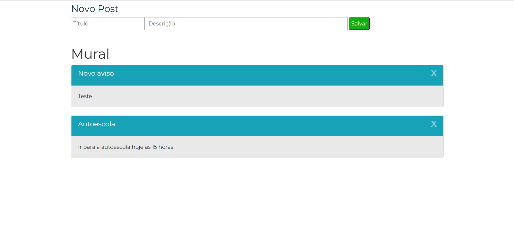

# Mural de Avisos - Node.Js

;

* 11º projeto, feito com HTML, CSS, JS, Bootstrap e Node.Js
* Este é um mural de avisos utilizando o Node.js para desenvolver o Back-end.
* Projeto do curso Web Full Stack - ProgBr.
* Requisições presentes no projeto: GET, POST e DELETE.
* API desenvolvida via Node.Js
* Projeto aperfeiçoado: CSS e Bootstrap melhorados. E também foi implementado a requisição do tipo DELETE ao projeto 